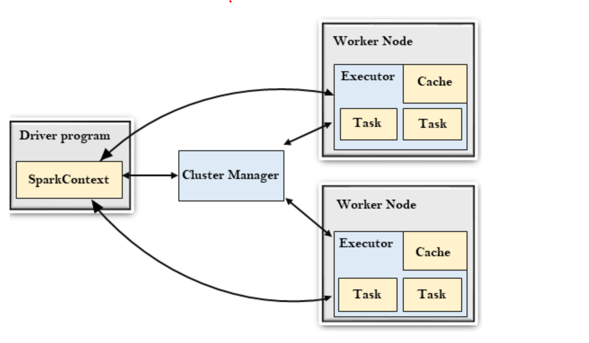

## What happens when a spark job is submitted?

### Spark Architecture

Spark architecture depends on two abstrations; RDD and DAG

* Resilient Distributed Data
  
  * Resilient because restore data on failure.
  * Data is distributed among different nodes.
  * group pf data.
  
* Directed Acyclic Graph
    Directed acyclic graph is a finite graph that performa a sequence of computation on data.
    Each node is RDD partitiion and edge is the transformation on top of data.

* Driver Program

The driver program is the main process that runs the main() function of the application.
It creates the spark context object. SparkContext further coordintes with the manager 
to distribute the job on different nodes which has executor, task and cache.

* Cluster Manager

- The role of the cluster manager is to allocate resource across the applications. It uses hadoop YARN, Apache Mesos and standalone scheduler.

* Worker Node

- The worker node is a slave node and its roles is to run the application code.

* Executor

An executor is the process launched for an application on a worker node. It runs the task and keeps data in memory or disk storage accross them.
It read and write data to the external sources. Every application contains its executor.




## Memory Allocation for a Node

**Reference**

<http://site.clairvoyantsoft.com/understanding-resource-allocation-configurations-spark-application/>

<https://github.com/vaquarkhan/vaquarkhan/wiki/How-to-calculate-node-and-executors-memory-in-Apache-Spark>

### Case 1 Hardware – 6 Nodes and each node have 16 cores, 64 GB RAM
First on each node, 1 core and 1 GB is needed for Operating System and Hadoop Daemons, so we have 15 cores, 63 GB RAM for each node

We start with how to choose number of cores:

Number of cores = Concurrent tasks an executor can run

So we might think, more concurrent tasks for each executor will give better performance. But research shows that any application with more than 5 concurrent tasks, would lead to a bad show. So the optimal value is 5.

This number comes from the ability of an executor to run parallel tasks and not from how many cores a system has. So the number 5 stays same even if we have double (32) cores in the CPU

* Number of executors:

Coming to the next step, with 5 as cores per executor, and 15 as total available cores in one node (CPU) – we come to 3 executors per node which is 15/5. We need to calculate the number of executors on each node and then get the total number for the job.

So with 6 nodes, and 3 executors per node – we get a total of 18 executors. Out of 18 we need 1 executor (java process) for Application Master in YARN. So final number is 17 executors

This 17 is the number we give to spark using –num-executors while running from spark-submit shell command

* Memory for each executor:

From above step, we have 3 executors per node. And available RAM on each node is 63 GB

So memory for each executor in each node is 63/3 = 21GB.

However small overhead memory is also needed to determine the full memory request to YARN for each executor.

The formula for that overhead is max(384, .07 * spark.executor.memory)

Calculating that overhead:  .07 * 21 (Here 21 is calculated as above 63/3) = 1.47

Since 1.47 GB > 384 MB, the overhead is 1.47

Take the above from each 21 above => 21 – 1.47 ~ 19 GB

So executor memory – 19 GB

Final numbers – Executors – 17, Cores 5, Executor Memory – 19 GB


## Case 2 Hardware – 6 Nodes and Each node have 32 Cores, 64 GB

* Available cores = 5 cores for each node. Anything more than 5 is performance degrading.

* Number of executor = 4/4 ~ 1

Total 4 executors (4 executors per node * 1 node.)
One executor reserved as cluster manger. Thus, 3 executors.

* Executor Memory
 32 - 1 gb reseverd for cluster oS and hadoop yarn.

 31/3 executor per node ~ 10 gb
 overhead memory = 0.7 * 10 = 700 mb.

 Therefore approx 9 gb per executor.


 ## Case 3 for a standalone node.

 1 node and it has 4 cores, 32 gb.

* Available cores = 4 cores.

* Number of executor = 31/5 ~ 6

Total 36 executors (6 executors per node * 6 nodes per cluster.)
One executor reserved as cluster manger. Thus, 35 executors.

* Executor Memory
 32 - 1 gb reseverd for cluster oS and hadoop yarn.

 31/3 executor per node ~ 10 gb
 overhead memory = 0.7 * 10 = 700 mb.

 Therefore approx 9 gb per executor.

Thus, 4 cores, 3 executor and 9gb memory for each executor.


## Cache and Persistent


Storage Level    Space used  CPU time  In memory  On-disk  Serialized   Recompute some partitions
----------------------------------------------------------------------------------------------------
MEMORY_ONLY          High        Low       Y          N        N         Y    
MEMORY_ONLY_SER      Low         High      Y          N        Y         Y
MEMORY_AND_DISK      High        Medium    Some       Some     Some      N
MEMORY_AND_DISK_SER  Low         High      Some       Some     Y         N
DISK_ONLY            Low         High      N          Y        Y         N


## Ways to store dataframes/rdds in memory

Spark Persistance storage levels 
  
All different storage level Spark supports are available at org.apache.spark.storage.StorageLevel class. The storage level specifies how and where to persist or cache a Spark DataFrame and Dataset.

* MEMORY_ONLY – This is the default behavior of the RDD cache() method and stores the RDD or DataFrame as deserialized objects to JVM memory. When there is no enough memory available it will not save DataFrame of some partitions and these will be re-computed as and when required. This takes more memory. but unlike RDD, this would be slower than MEMORY_AND_DISK level as it recomputes the unsaved partitions and recomputing the in-memory columnar representation of the underlying table is expensive

* MEMORY_ONLY_SER – This is the same as MEMORY_ONLY but the difference being it stores RDD as serialized objects to JVM memory. It takes lesser memory (space-efficient) then MEMORY_ONLY as it saves objects as serialized and takes an additional few more CPU cycles in order to deserialize.

* MEMORY_ONLY_2 – Same as MEMORY_ONLY storage level but replicate each partition to two cluster nodes.

* MEMORY_ONLY_SER_2 – Same as MEMORY_ONLY_SER storage level but replicate each partition to two cluster nodes.

* MEMORY_AND_DISK – This is the default behavior of the DataFrame or Dataset. In this Storage Level, The DataFrame will be stored in JVM memory as a deserialized object. When required storage is greater than available memory, it stores some of the excess partitions into the disk and reads the data from the disk when required. It is slower as there is I/O involved.

* MEMORY_AND_DISK_SER – This is the same as MEMORY_AND_DISK storage level difference being it serializes the DataFrame objects in memory and on disk when space is not available.

* MEMORY_AND_DISK_2 – Same as MEMORY_AND_DISK storage level but replicate each partition to two cluster nodes.

* MEMORY_AND_DISK_SER_2 – Same as MEMORY_AND_DISK_SER storage level but replicate each partition to two cluster nodes.

* DISK_ONLY – In this storage level, DataFrame is stored only on disk and the CPU computation time is high as I/O is involved.

* DISK_ONLY_2 – Same as DISK_ONLY storage level but replicate each partition to two cluster nodes.

Below are the table representation of the Storage level, Go through the impact of space, cpu and performance choose the one that best fits for you


## Broadcast Variable

PySpark RDD Broadcast variable example
Below is a very simple example of how to use broadcast variables on RDD. This example defines commonly used data (states) in a Map variable and distributes the variable using SparkContext.broadcast() and then use these variables on RDD map() transformation.

```

import pyspark
from pyspark.sql import SparkSession

spark = SparkSession.builder.appName('SparkByExamples.com').getOrCreate()

states = {"NY":"New York", "CA":"California", "FL":"Florida"}
broadcastStates = spark.sparkContext.broadcast(states)

data = [("James","Smith","USA","CA"),
    ("Michael","Rose","USA","NY"),
    ("Robert","Williams","USA","CA"),
    ("Maria","Jones","USA","FL")
  ]

rdd = spark.sparkContext.parallelize(data)

def state_convert(code):
    return broadcastStates.value[code]

result = rdd.map(lambda x: (x[0],x[1],x[2],state_convert(x[3]))).collect()

```

## When do we need to call cache or persist on a RDD?

Refrence: <https://stackoverflow.com/questions/28981359/why-do-we-need-to-call-cache-or-persist-on-a-rdd>

Spark processes are lazy, that is, nothing will happen until it's required. To quick answer the question, after val textFile = sc.textFile("/user/emp.txt") is issued, nothing happens to the data, only a HadoopRDD is constructed, using the file as source.

Let's say we transform that data a bit:

val wordsRDD = textFile.flatMap(line => line.split("\\W"))
Again, nothing happens to the data. Now there's a new RDD wordsRDD that contains a reference to testFile and a function to be applied when needed.

Only when an action is called upon an RDD, like wordsRDD.count, the RDD chain, called lineage will be executed. That is, the data, broken down in partitions, will be loaded by the Spark cluster's executors, the flatMap function will be applied and the result will be calculated.

On a linear lineage, like the one in this example, cache() is not needed. The data will be loaded to the executors, all the transformations will be applied and finally the count will be computed, all in memory - if the data fits in memory.

cache is useful when the lineage of the RDD branches out. Let's say you want to filter the words of the previous example into a count for positive and negative words. You could do this like that:

val positiveWordsCount = wordsRDD.filter(word => isPositive(word)).count()
val negativeWordsCount = wordsRDD.filter(word => isNegative(word)).count()
Here, each branch issues a reload of the data. Adding an explicit cache statement will ensure that processing done previously is preserved and reused. The job will look like this:

val textFile = sc.textFile("/user/emp.txt")
val wordsRDD = textFile.flatMap(line => line.split("\\W"))
wordsRDD.cache()
val positiveWordsCount = wordsRDD.filter(word => isPositive(word)).count()
val negativeWordsCount = wordsRDD.filter(word => isNegative(word)).count()
For that reason, cache is said to 'break the lineage' as it creates a checkpoint that can be reused for further processing.

Rule of thumb: Use cache when the lineage of your RDD branches out or when an RDD is used multiple times like in a loop.

## RDDs vs. Dataframes vs. Datasets – What is the Difference and Why Should Data Engineers Care?

What are RDDs?
RDDs or Resilient Distributed Datasets is the fundamental data structure of the Spark. It is the collection of objects which is capable of storing the data partitioned across the multiple nodes of the cluster and also allows them to do processing in parallel.

Overview
Understand the difference between 3 spark APIs – RDDs, Dataframes, and Datasets
We will see how to create RDDs, Dataframes, and Datasets
 

Introduction
It has been 11 years now since Apache Spark came into existence and it impressively continuously to be the first choice of big data developers. Developers have always loved it for providing simple and powerful APIs that can do any kind of analysis on big data.

RDDs Dataframes datasets

Initially, in 2011 in they came up with the concept of RDDs, then in 2013 with Dataframes and later in 2015 with the concept of Datasets. None of them has been depreciated, we can still use all of them. In this article, we will understand and see the difference between all three of them.

 

Table of Contents
What are RDDs?
When to use RDDs?
What are Dataframes?
What are Datasets?
RDD vs Dataframes vs Datasets?
 

Loading Image
1729- Category Defining AI Event
An event like never before, all industry leaders of AI are going to be there. ARE YOU?
What are RDDs?
RDDs or Resilient Distributed Datasets is the fundamental data structure of the Spark. It is the collection of objects which is capable of storing the data partitioned across the multiple nodes of the cluster and also allows them to do processing in parallel.

It is fault-tolerant if you perform multiple transformations on the RDD and then due to any reason any node fails. The RDD, in that case, is capable of recovering automatically.

RDDsThere are 3 ways of creating an RDD:

Parallelizing an existing collection of data
Referencing to the external data file stored
Creating RDD from an already existing RDD
# parallelizing data collection
my_list = [1, 2, 3, 4, 5]
my_list_rdd = sc.parallelize(my_list)

## 2. Referencing to external data file
file_rdd = sc.textFile("path_of_file")
view rawrdd_23.py hosted with ❤ by GitHub
 

When to use RDDs?
We can use RDDs in the following situations-

When we want to do low-level transformations on the dataset. Read more about RDD Transformations: PySpark to perform Transformations
It does not automatically infer the schema of the ingested data, we need to specify the schema of each and every dataset when we create an RDD. Learn how to infer the schema to the RDD here: Building Machine Learning Pipelines using PySpark
 

What are Dataframes?
It was introduced first in Spark version 1.3 to overcome the limitations of the Spark RDD. Spark Dataframes are the distributed collection of the data points, but here, the data is organized into the named columns. They allow developers to debug the code during the runtime which was not allowed with the RDDs.

Dataframes can read and write the data into various formats like CSV, JSON, AVRO, HDFS, and HIVE tables. It is already optimized to process large datasets for most of the pre-processing tasks so that we do not need to write complex functions on our own.


What are Datasets?
Spark Datasets is an extension of Dataframes API with the benefits of both RDDs and the Datasets. It is fast as well as provides a type-safe interface. Type safety means that the compiler will validate the data types of all the columns in the dataset while compilation only and will throw an error if there is any mismatch in the data types.

## Shuffling

Reference: <https://sparkbyexamples.com/spark/spark-shuffle-partitions/#:~:text=The%20Spark%20SQL%20shuffle%20is,partitions%20configuration%20or%20through%20code>

The Spark SQL shuffle is a mechanism for redistributing or re-partitioning data so that the data is grouped differently across partitions, based on your data size you may need to reduce or increase the number of partitions of RDD/DataFrame using spark.sql.shuffle.partitions configuration or through code.

```

val spark:SparkSession = SparkSession.builder()
    .master("local[5]")
    .appName("SparkByExamples.com")
    .getOrCreate()

val sc = spark.sparkContext

val rdd:RDD[String] = sc.textFile("src/main/resources/test.txt")

println("RDD Parition Count :"+rdd.getNumPartitions)
val rdd2 = rdd.flatMap(f=>f.split(" "))
  .map(m=>(m,1))

//ReduceBy transformation
val rdd5 = rdd2.reduceByKey(_ + _)

println("RDD Parition Count :"+rdd5.getNumPartitions)

#Output
RDD Parition Count : 3
RDD Parition Count : 3


```


